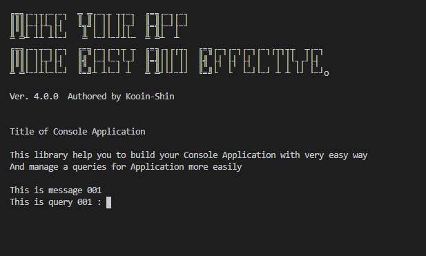

# console-input-manager

 

## Introduction

This library help you to build Java console input process on your console application. 

Also it's provide more effective and easy way of development console application.

You can define interactive queries which be need on the application as user input and set up each queries with full-managed way.

## How to install

To use this library on your application development, You already have to be installed Java Development Environment(JDK)  on your computer.

And you need to download Jar file on **Release menu** in this project. 

Because of being used with **Snake YAML** library, you should be got the library on your project classpath.

## How to use

